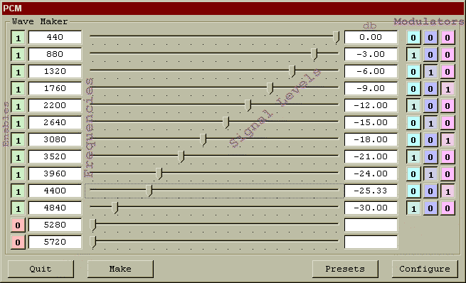



## PcmRiff

### Description

PcmRiff generates and mixes Sine Wave based data to produce a standard Type 1 Riff File (.WAV) in either 8-bit, 16-bit or 24-bit bandwidths at just about any sample rate. The files generated are standard files that can be used with any application, including samplers or sounds for your PC. Complete and extensive demo project included. Recently corrected - the square wave patch was wrong - fixed.
 
### More Info
 
The primary PcmRiff code module and included text files should contain sufficient documentation for the use of the module.

Some hardware cannot support the 24-bit formats, and while there are work-around routines included in the PcmRiff code module, memory limitations can present problems.

             |
---                |---
**Submitted On**   |2002-04-04 22:33:48
**By**             |[Urthman](https://github.com/Planet-Source-Code/PSCIndex/blob/master/ByAuthor/urthman.md)
**Level**          |Intermediate
**User Rating**    |5.0 (10 globes from 2 users)
**Compatibility**  |VB 5\.0, VB 6\.0
**Category**       |[Sound/MP3](https://github.com/Planet-Source-Code/PSCIndex/blob/master/ByCategory/sound-mp3__1-45.md)
**World**          |[Visual Basic](https://github.com/Planet-Source-Code/PSCIndex/blob/master/ByWorld/visual-basic.md)
**Archive File**   |[PcmRiff69031452002\.zip](https://github.com/Planet-Source-Code/urthman-pcmriff__1-33428/archive/master.zip)

